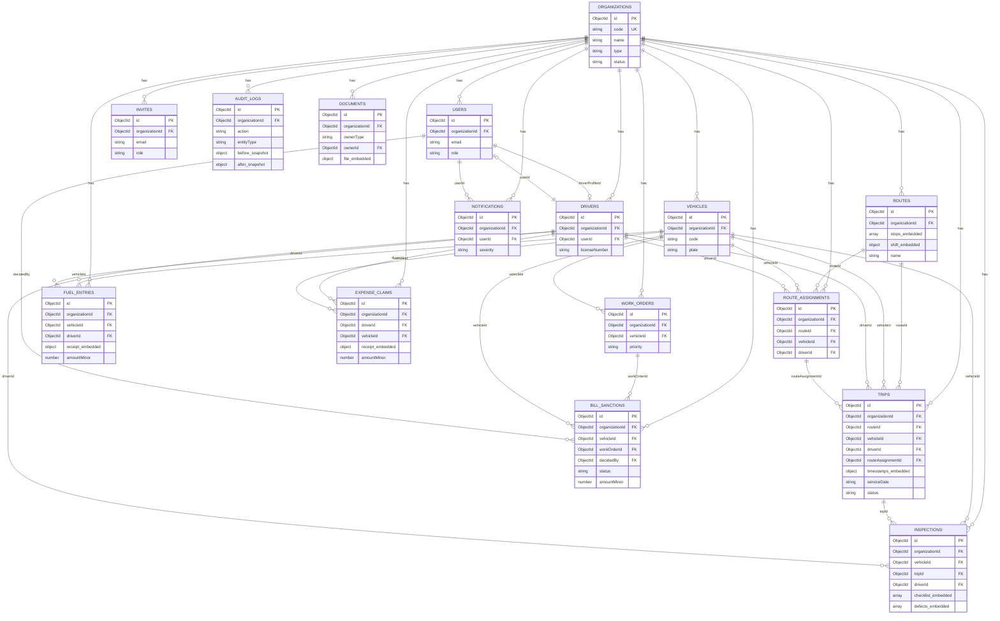
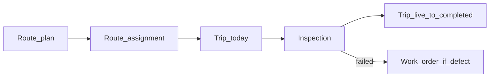

# Entity relationships (ERD)

Multi-tenant: almost every node hangs under **Organization**.  
`organizations.type`: `school` | `college` | `travel` | `fleet` | `other`.  
Solid lines = reference by ObjectId. Embedded structures are noted in field names.

---

## Aggregate boundaries (DDD-style)

| Aggregate | Root collection | Embedded |
|-----------|-----------------|----------|
| Organization | `organizations` | — |
| Identity | `users`, `invites` | — |
| Fleet asset | `vehicles` | — |
| Driver profile | `drivers` | — |
| Route plan | `routes` | `stops`, `shift` |
| Assignment | `route_assignments` | — |
| Trip execution | `trips` | `timestamps` |
| Inspection | `inspections` | `checklist`, `defects` |
| Maintenance | `work_orders` | — |
| Fuel | `fuel_entries` | `receipt` |
| Expense | `expense_claims` | `receipt` |
| Bill | `bill_sanctions` | — |
| Document | `documents` | `file` |
| Notification | `notifications` | — |
| Audit | `audit_logs` | snapshots in `before`/`after` |

---

## Daily operations flow

